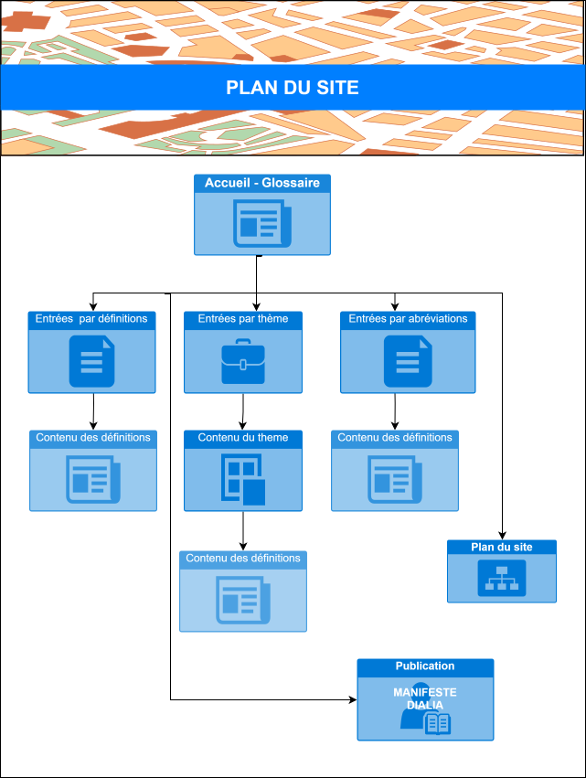
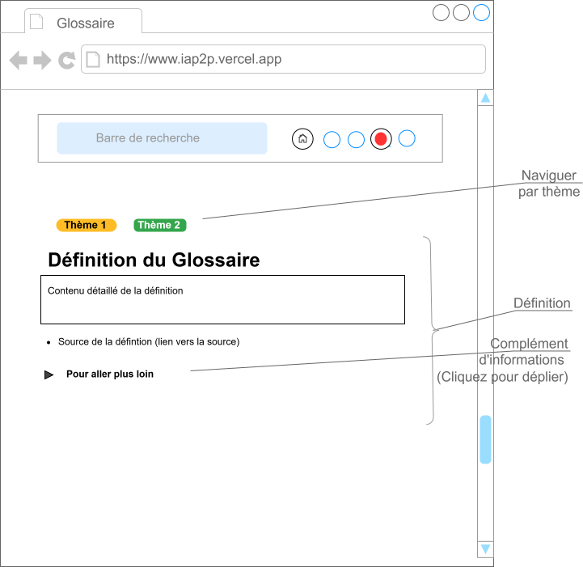

# Glossaire DIALIA

## Présentation

**Objectif** :

L'objectif initial était de mettre à dispostion un outil de type <strong> web documentaire </strong> permettant de contribuer au dialogue social technologique au travail.

> <fieldset>
> Le livrable partagé ici se présente sous la forme d'<strong> un glossaire, évolutif et interactif, de définitions utiles, et de références juridiques dans le domaine du numérique et de la conception de SIA </strong>.  
> </fieldset>
>  

**Le besoin** :

Ce web documentaire doit pouvoir faciliter l'animation d'un atelier d'acculturation sur les thématiques :

- de l'<strong>intelligence artificielle</strong>
- de la <strong>conception de projet de SIA</strong>.

<u>Public cible</u> : Les parties prenantes d'un projet de SIA :

- pour une consultation individuelle ou
- pour un usage en collectif lors, par exemple, d'une animation dans le cadre d'un atelier de sensibilisation aux enjeux du dialogue social à propos d'IA.

**Contexte** :

L'outil a été réalisé dans le cadre des ateliers du Projet DIALIA, à l'initiative des contributeurs de la thématique "Acculturation à l'IA" .

> Le projet DIALIA (“Dialogue IA”) est coordonnée par l’ IRES , avec la contribution de l'ANACT, en partenariat avec quatre des organisations syndicales membres de l’Institut.

 

### Les fonctionnalités générales du glossaire :

- Un **moteur de recherche**
- Une **entrée par thématiques** permet de naviguer facilement entre les notions
- Une entrée via la **liste des définitions couvertes**
- Une entrée via **une liste d'abréviations utiles**
- La navigation est faciltée par un **systeme de renvois et de références entre concepts** clés via un sensemble de tags ou catégories
- Le **"fil d'ariane" de la navigation est interactif**. L'ensemble des articles consultés constitue le flux de la page active. Elle différe donc selon les pages visitées et le questionnement spécifique de l'utilisateurs.
- Quand c'est possible, **les articles d'un thème sont présentés sous la forme d'un graphe de connaissances** navigable.

### Le choix des technologies utilisées:

###### Benchmark des solutions techniques open source en fonction des fonctionnalités attendues d'un web documentaire

| Fonctionnalités attendues                  | Markdowwn /Marp | Tiddlywiki.js | autre framework web (exemple reveal.js) |
| ------------------------------------------ | --------------- | ------------- | --------------------------------------- |
| Diffusion web de texte                     | **oui**         | **oui**       | **oui**                                 |
| Diffusion web de photo                     | **oui**         | **oui**       | **oui**                                 |
| Diffusion de video                         | non             | **oui**       | oui   (intgré avec plugin) )         |
| Diffusion de sons audio                    | non             | **oui**       | oui                                     |
| Modalités d'animation interactive          | limitée         | **oui**       | developppement   spécifique          |
| Modalités de navigation non linéaire       | non             | **oui**       | developppement   spécifique          |
| Modalités de datavisualisation interactive | non             | **oui**       | developppement   spécifique          |
| Possibilité de personnaliser le contenu    | **oui**         | **oui**       | developppement   spécifique          |
| Possibilité narrative                      | non             | **oui**       | oui                                     |
| Modalité de quizz ou d'évaluation          | **oui**         | **oui**       | developppement   spécifique          |

<strong> Les plateformes de service dédiées au web documentaire </strong> 

Liste non exhaustives :

- [Plateforme klynt](https://www.klynt.net/fr/pricingklynt/)
- [Plateforme Racontr](https://r83c929680.racontr.com/)
- [Plateforme Génially](https://genial.ly/fr/)
- [Plateforme Thinglink](https://www.thinglink.com/fr/)

</fieldset>

##### <u>Le glossaire est developé autour de la brique logicielle tiddlywiki</u>

 

> <fieldset>
> L'application choisie pour porter le glossaire DIALIA est donc <b> <i> TiddlyWiki </i></b>.
> </fieldset>

 

- <u>Principe</u> : <b> C'est une application de bloc-notes personnelle basée sur une application wiki. </b>
  - Site de référence : [https://tiddlywiki.com/](https://tiddlywiki.com/)

 

- <u> Avantages</u> :

  - Dynamique : En plus d'être un <b>site Web statique </b>, TiddlyWiki est implémenté comme une <strong>application monopage (SPA)[]</strong>. Ainsi, Tidlywiki permet d'intégrer une logique d'application dans des pages Web pour les rendre dynamiques.
  - [[Licence libre]]
  - [[Ecoconception]] et sécurité : leger en taille (environ 10 Mo en tout) et executé uniquement sur le poste de l'utilisateur par le navigateur (pas de serveur, pas de tiers partie)
  - Simple et securisé: <strong> Le fichier HTML
    contient tout ce qui est nécessaire pour démarrer l'application (pas de dépendances). </strong> Il est exportable facilement, pour une consultation en local. Il suffit d'utiliser la barre d'outil en haut à droite de la page d'accueil pour le télécharger en local.

 

- <u>Principes techniques </u>:
  - D'un point de vue technique, TiddlyWiki est <strong>une architecture [[MVC]] </strong> assez classique, avec une séparation stricte des tâches. Le modèle (Model) est le magasin tiddler, la vue (View) est un arbre de rendu et le contrôleur (Controllers) est le code principal lui-même.
  - TiddlyWiki peut être considéré comme faisant partie de la <strong>Jamstack </strong>: En fait, il existe des projets comme [[Tddlyjam|https://tiddlyjam.com/]] qui permettent de transformer TiddlyWiki en sites statiques et blogs, inspirés par l'approche [[JAMstack]]. Cela permet de créer des applications web modernes et performantes en utilisant TiddlyWiki comme base.
  - Plugins variés disponibles et open source :
    - Gestion de Mardown
    - Construction de graphe de connaissance avec Graphviz
    - Dessiner en utilisant nativement avec les fonctionnalités de draw.io

 

	
 <strong> Pour aller plus loin avec Tiddlywiki: </strong>
	

	
* Site pour les developpeurs : [[https://tiddlywiki.com/dev/]]

- [[https://tw5magick.tiddlyspot.com/]]

- [[https://tiddlyhost.com/]]

- [[Liste des dépot GIT de tiddlywiki|https://github.com/TiddlyWiki]]

  - endpoint API GitHub des dépots avec tiddlywiki5: [[https://api.github.com/search/repositories?q=TiddlyWiki]]

  - endpoint du dépot principal de tiddlywiki: [[https://api.github.com/repos/tiddlywiki/tiddlywiki5]]

- [[TiddlyWiki toolmap|https://dynalist.io/d/zUP-nIWu2FFoXH-oM7L7d9DM]]

### FAQ pour utiliser l'outil une fois déployé :

#### plan du site

#### La page d'accueil

#### Les pages de déinition

